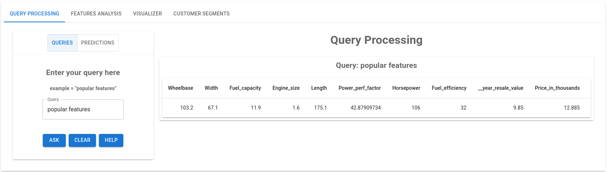

# 📊 Data analytics in car dataset 
## (MS Engage 2022 Final submission).

  
  Demonstration of how the Automotive Industry could harness data to take informed decisions.

## Introduction

  This application demonstrate how the automotive industry could harness the data to take informed decision. Any techinal head can use this type of application so that they can take necessary actions in their organisation. This application let you guide to dive into the data and help you identifying the trends and relations between the data, which help you to form queries for example what are some popular features set which customers choose the most, by entering this query in query processor you will get desire output which again based on the dataset that we are using. This application only meant for car dataset that was provided by kaggle and display query results and predictions only based on the model that were created using this dataset.<b> 

This is just a frontend of the entire application, and you can find the backend of the application in </b> https://github.com/ishaan-pare/car_data_analysis_backend.git. 

## System requirements

Before installation let see what you need 
* Laptop or PC (this application is non responsive in mobiles)
* nodejs version>=16
* 
## Installation

* Open terminal or command prompt and do following step by step
* Clone the repository by using following command
* git clone url/to/this/repo
* cd to the cloned repository named car_data_analysis_frontend or car_data_analysis_frontend_main
* Type npm install and hit enter, all the dependencies will install in your laptop
* Now you can start frontend by typing npm start

#### Or else You can go through given [link]( https://analysiscar.herokuapp.com/)

## How to use?

### Once the application is lauched you will see screen given below.

  

This is the very first screen you will see after launching the application. This is Query Processing tab which resolve your query and also predict some of the parameters like features, price, sales.

#### Types of query processing 

1) Simple queries without Machine learning at backend.
   This types of query require a command which include 
   * Keyword like , popular, max..
   * Noun
   * Specifier (if any)

   Based upon above parameter syntax of the query will look like<b> <Keyword+Noun+Specifier> </b>.
   
   Examples of queries 
    * popular features 
    * max enginesize 
    * popular features between 1 20 price 
    * popular enginesize between 2 12 price 
    etc .. (make sure all the sentence should be in lowercase and all string should be same otherwise application will not respond for results)
    
2) Queries which involve use of Machine learning at backend.
    This type of queries only want three things from user
  
   * What type information do you have ?
   * What information do you want to predict ?
   * Data you have
  
    From information there are 3 types of information
   * Price
   * Sales
   * HarFeatures which include
      1. wheelbase, 2. Fuel capacity, 3. Width, 4. Engine_size, 5. Length
   * SoftFeatures which include
      1. powerperfactor, horsepower, yearresalevalue, fuelefficiency/mileage

### After clicking on Features Analysis
  

  
  This is the very first screen you will see after launching the application. This is Query Processing tab which resolve your query and also predict some of the parameters like features, price, sales.

* Once the application is lauched you will see screen given below.

  
  This is the very first screen you will see after launching the application. This is Query Processing tab which resolve your query and also predict some of the parameters like features, price, sales.

* Once the application is lauched you will see screen given below.

  
  This is the very first screen you will see after launching the application. This is Query Processing tab which resolve your query and also predict some of the parameters like features, price, sales.

